# Your new website: before and after

**Will Fraley, Attorney at Law · willfraleylaw.com · report dated 3 October 2026**

## The one-page summary

The new site is ready to put online. It has the same web addresses, the same phone number, the same office
and the same real photographs of you. It is much faster, easier to read and easier to use, and every page now
has a Spanish version.

- **Faster on phones.** On a typical page, the main content used to take about **8.1 seconds** to appear on a
  mid-range phone. It now takes about **1.7 seconds**. Each page downloads about **131 KB** instead of
  **846 KB**.
- **Top marks on Google's quality test.** On the typical page, the scores went from **54 / 90 / 81 / 100** to
  **100 / 100 / 100 / 100** (speed / accessibility / good practice / search basics).
- **Easier to use for people with disabilities.** The automated accessibility test found **73 serious
  problems** across the 24 old pages (each kind of problem counted once per page). It found **none** on any of
  the 60 new pages. Automated tests cannot catch everything, so the new Accessibility Statement tells visitors
  how to report a problem.
- **Easier to read.** The writing dropped from about a **9th-grade** reading level to about a **6th-grade**
  level. That suits someone reading on a phone in a stressful moment.
- **In Spanish too.** The old site had 24 pages, all in English. The new site has **30 English and 30
  Spanish** pages, including new Privacy, Accessibility and Cookie Settings pages.
- **Old links keep working.** We found **89** old web addresses. The 24 main pages keep their exact addresses,
  **39** other old addresses forward to the closest new page, and **26** old WordPress short links open the
  home page for now (see "Known limitations").
- **Nothing invented.** Every fact on the new site (phone, address, hours, experience, education, memberships,
  reviews) is traced to an exact quote on your current site. The wording around the facts is new; the facts
  are not. We recorded **315** facts, each with the page it came from. Where your old site contradicted itself,
  we used the wording that is true under every version and wrote the question down for you. The only new
  promises are the privacy and accessibility commitments, which we ask you to confirm (question 4).

What we need from you is at the end of this report ("Questions for you"). None of it stops the launch.

## Before and after, in numbers

"Typical page" means the middle value (the median) across pages, so one unusually slow or fast page does not
skew it. The old site was measured on 24 pages. The new site was measured on the same 24 pages and on all of
its tested pages (58 for speed, which leaves out the two "page not found" pages; 60 for accessibility). Speed
tests simulate a mid-range phone on a mobile connection.

| What we measured | Old site (median of 24 pages) | New site, same 24 pages (median of 24 pages) | New site, every tested page (median of 58 pages) |
|---|---|---|---|
| Google speed score (out of 100) | 54 | 100 | 100 |
| Google accessibility score (out of 100) | 90 | 100 | 100 |
| Google good-practice score (out of 100) | 81 | 100 | 100 |
| Google search-basics score (out of 100) | 100 | 100 | 100 |
| Time until the main content shows | 8.1 seconds | 1.7 seconds | 1.7 seconds |
| Time the page is frozen while loading | 0.37 seconds | 0 seconds | 0 seconds |
| How much the page jumps while loading (0 = none) | 0.003 | 0 | 0 |
| Page weight (data each visit downloads) | 846 KB | 131 KB | 129 KB |
| Program code (JavaScript) in separate files per page | 430 KB | 0 KB | 0 KB |
| Separate files each page requests | 81 | 9 | 9 |
| Serious + critical accessibility problems (total) | 73 serious, 0 critical, on 24 pages | 0 on 24 pages | 0 on 60 pages |
| Places you can land on with the keyboard's Tab key that show no outline | 787 of 1,241 | 0 of 1,440 | 0 of 3,237 |
| Reading grade level (school grade needed to read it easily) | about 9.3 | about 6 (median of 30 English pages) | — |
| Pages | 24 (English only) | — | 30 English + 30 Spanish |

**Where these numbers come from.** Speed and quality scores come from Lighthouse, Google's free page-testing
tool (`audit/lighthouse-before.json` for the old site, `qa/lighthouse.json` for the new one). Accessibility
counts come from axe, a widely used automated accessibility checker (`audit/axe-before.json`, `qa/axe.json`).
The old site's search-basics score was
already 100 on the typical page. Its search problems were in the words, not the technical setup: no main
headline on any page, and "Murfreesboro" misspelled in 15 titles.

**How the reading grade was worked out.** The old site's grade (about 9.3, median) comes from our content
review (`audit/A03.md`). For the new site we ran a standard Flesch-Kincaid estimate on the body text of each of
the 30 English pages. We counted sentences, words and syllables, using a common rule of thumb for syllables.
Headings, layout notes, internal notes and link addresses were removed first. We then took the median.
Depending on small choices in how sentences and syllables are counted, the result is between about 5.6 and
6.5, so we call it "about 6". The short "page not found" and "thank you" pages read easiest; Home, Legal
Services and the Accessibility Statement read hardest. As a cross-check, the same counters run on the old
site's saved text give between 8.5 and 9.9. Either way, the new writing is about three grade levels easier to
read.

**One honest caveat.** The old site was measured live over the internet. The new site was measured on a copy
running on our own test machine, with the same simulated phone and connection. Once the site is live on
Cloudflare (the company that will host it), real visitors may see somewhat different times. We expect the gap
to hold (about 8 seconds down to about 2), because each new page downloads about one-sixth as much data.

## How the pages look on a phone

Each pair shows the old page on the left and the new page on the right, as they appear on a phone 390 pixels
wide. The PDF version shows the first phone screen of each. The full-length captures are in
`inventory/shots/before/` (old) and `REPORT/shots/after/` (new).

### Home

| Old site | New site |
|---|---|
| 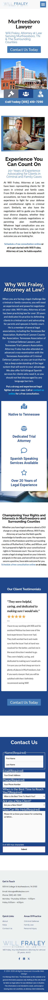 | 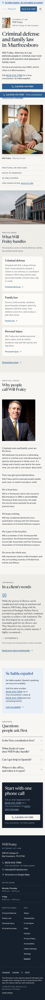 |

The old first screen shows "Contact Us Today" and a stock photo of a building. The new first screen says what
you do, shows "since 2004", gives a large call button with the full number, and offers Spanish at the top.

### Criminal Defense

| Old site | New site |
|---|---|
|  | 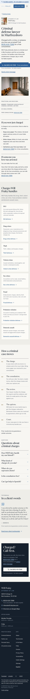 |

### DUI

| Old site | New site |
|---|---|
|  |  |

### Family Law

| Old site | New site |
|---|---|
|  | 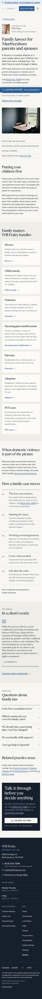 |

### Divorce

| Old site | New site |
|---|---|
|  | 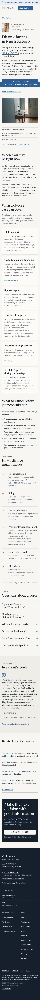 |

### DCS Cases

| Old site | New site |
|---|---|
| 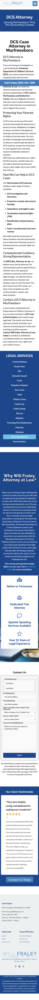 | 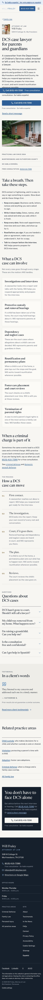 |

### About

| Old site | New site |
|---|---|
| 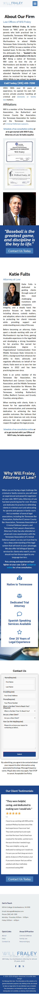 |  |

### Contact

| Old site | New site |
|---|---|
| 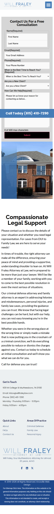 | 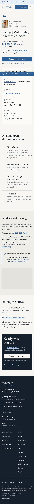 |

The old Contact page opens straight into a seven-question form. The new one starts with a phone call, then
offers a short message as a second choice.

## The three designs we considered, and the one we built

We built three working sample designs of the Home, Criminal Defense and Contact pages.

- **A, "Counsel":** calm and serious, built on strong type, your logo blue and plenty of white space.
- **B, "Verdict":** bold and direct, with dark bands and a bright gold call button.
- **C, "Neighbor":** warm and local, with a large town photograph and sandy tones.

**We built A, "Counsel."** Most people who find you are on a phone and in trouble. They may have been charged
last night, be worried about a family member, or be facing a custody fight. On a phone, Counsel's first screen
gives them what you do, "practicing since 2004", a large "Call (615) 410-7290" button, "Se habla español" and
a one-tap switch to Spanish. It uses few pictures, so it loads fastest. Its calm look suits a worried parent as
well as someone facing a charge. Verdict felt harsh for family cases. Neighbor put its call button lower and
loaded slowest.

We borrowed two touches from the other designs. From B, the call button at the top of every phone screen shows
the full number. From C, a small photo of you sits beside your name near the top of most pages.

## What we kept, and why

- **Every page address.** All 24 page addresses are unchanged. Of the other old addresses we found (old page
  names, image links, feeds, sitemaps), 39 send visitors to the closest new page in one step, and 26 old
  WordPress short links open the home page until one Cloudflare setting is added (see "Known limitations").
  This protects what you have earned in Google and keeps old links working.
- **Your facts, exactly.** Phone (615) 410-7290, 509 W College St, inbox@willfraleylaw.com, the office hours,
  "practicing law since 2004", your Nashville School of Law degree and your memberships. Each is copied from
  your current site, and each is traced to the page it came from.
- **Your photographs.** Your two portraits (at your desk, and in the brick doorway) and Katie Fults's
  photograph. They are cropped and color-matched only, never retouched or imitated. Your two training
  certificates are shown as documents on the About page.
- **Your logo** and its blue (#447CB7), used as the base of the new color scheme.
- **Your three client reviews, word for word.** They keep their original wording, including one that is cut
  off and one with a missing word, because changing a client's words is not ours to do. Star graphics were
  dropped until we know where the reviews were posted. Each sits beside "Prior results do not guarantee a
  similar outcome."
- **The legal disclaimer's substance:** the site is general information, not legal advice, and reading it
  does not create an attorney-client relationship.
- **The DCS and Adoption pages.** None of the competing local firm sites we reviewed has a DCS page.

## What we fixed

These are the ten main problems from the website audit (`audit/AUDIT.md`), and what the new site does about each.

1. **Hard to call you.** The number appeared in the body of only one page, a sentence on three pages was
   missing it ("…online or at to get started"), and some buttons went nowhere. *Now:* the number is a
   tap-to-call link in the header, the opening section, mid-page, the footer and a bar along the bottom of
   every phone screen. Every "free consultation" offer sits right beside it. The broken sentence is gone, and
   the final check found no broken links.
2. **Slow on phones.** About 8 seconds to show the main content. *Now:* about 1.7 seconds, with no page-builder
   code, two typefaces stored on the site, and right-sized modern images.
3. **"Se habla español" with nothing in Spanish.** *Now:* a full Spanish version of every page at `/es/`, with
   Spanish web addresses, a language switch on every page and a Spanish contact form.
4. **Facts that disagreed with each other** (years of experience stated 11 ways, seven firm names, two Friday
   closing times). *Now:* only wording that is true under every version: "Practicing law since 2004", "Will
   Fraley, Attorney at Law", Friday until 4:00. The open questions are listed for you below.
5. **Wording the Tennessee advertising rules flag** ("experts", "premier", "aggressive", reviews with no
   disclaimer). *Now:* plain, accurate language, no comparisons with other lawyers, and the results disclaimer
   wherever a review appears. An automated check blocks risky words before anything is published.
6. **Google couldn't tell what each page was about.** There was no main headline, and 15 titles misspelled the
   city. *Now:* each page has one clear headline, its own correct title and its own description. Theft and
   Drug Crimes are full pages now.
7. **Hard to use with a keyboard, a screen reader (software that reads the screen aloud) or larger text.**
   *Now:* built to WCAG 2.2 AA, the accessibility standard most often used for websites, with a visible outline on every keyboard stop, tested color contrast, a natural form order and nothing that
   moves by itself. The new Accessibility Statement explains how to report a problem.
8. **No privacy policy, cookie choice or accessibility statement, while Google Analytics ran without asking.**
   *Now:* Privacy, Cookie Settings and Accessibility Statement pages in English and Spanish, linked in every
   footer. No tracking runs at all at launch. The form warns visitors not to send confidential details.
9. **Too much in the way.** A 27-link menu loaded four times per page, and an 18-link sidebar. *Now:* one menu
   with six items, the phone number and a language switch. The bottom call bar never covers a form field.
10. **A borrowed look** (stock handcuffs and gavels, computer screenshots, five typefaces). *Now:* your real
    photos first, one type pairing, a sharp logo, and newly made scenes of Middle Tennessee and law-office
    settings. None of these scenes shows a person.

## Images

- **Reused from your site:** 6 images. These are your two portraits, Katie Fults's photograph, the logo and
  your two training certificates (`inventory/assets.json`, verdict "reuse").
- **Newly generated:** 33 images were kept: 24 used across the new site and 9 made for the three sample
  designs. Together they cost **66 credits** (`images/GENERATED.json`). Counting the 7 attempts we rejected
  and remade, **80 credits** were spent in total (26 for the samples and 54 for the site,
  `plan/DECISIONS.md`). Every generated image is a scene, object or texture: Middle Tennessee roads, rivers and
  porches, courthouse-square architecture with no readable signs, and office interiors. None shows a person or
  a face. Each prompt is saved alongside its image.

## Questions for you

There are 151 notes in `NEEDS-OWNER.md`, the full list of questions from everyone who worked on the site. Many
repeat the same question. Grouped, they come down to the 23 questions below, most important first, each with
the pages it affects. Until you answer, the site uses the safest true wording, so none of these stops the
launch.

**Please answer before launch**

1. **Spanish pages (all pages under `/es/`, especially the Theft page):** Can a Spanish speaker at the office
   read the Spanish pages once? Who helps a caller who speaks only Spanish? Should "theft" read *robo* or
   *hurto*?
2. **Bar standing and memberships (About page, footer):** Is your license in good standing on tbpr.org? What
   year were you admitted to the Tennessee bar? Which memberships are current (TBA, Rutherford and Cannon County
   Bar, TACDL), and are you a member of the Tennessee Association for Justice?
3. **Statements about Tennessee law (DUI, Fraud, Sex Crimes, Domestic Assault, Divorce, Child Custody,
   Visitation, Paternity, Personal Injury and FAQs pages, in English and Spanish):** Are the general statements
   carried over from your old site still correct? Examples: DUI penalties in general terms, equitable
   distribution in divorce, "best interests of the child", sex-offender registration, "many fraud charges are
   felonies", and the personal-injury FAQ answers. We kept them general and dropped every specific number.
4. **Privacy Policy, Accessibility Statement and Cookie Settings pages (English and Spanish):** Can you read
   them once? How long do you keep website messages? Is it true that you never sell or share them?

**Facts your old site stated more than one way**

5. **Experience (Home, About, footer):** May we say "over 20 years"? (Now: "practicing law since 2004".) What
   year did you open your own firm?
6. **Firm name and your name (every page; About):** Is the name "Will Fraley, Attorney at Law" or another
   registered name? Is "Raymond Wilford Fraley, III" exactly as on your bar record?
7. **Friday hours (footer of every page, Contact):** Do you close at 4:00 or 5:00 on Fridays? (Now: 4:00, as
   in your old footer.) Are calls answered after hours?
8. **Who is on the team (About, family-law pages, Testimonials):** Is Katie Fults still with the firm, and what
   does she handle? Is Melissa Harris still with you?
9. **Where you practice (Home and every practice page):** Which counties and courts do you appear in? Do you
   take federal cases? Should Smyrna and La Vergne be named?
10. **Free consultation (every page with a call button):** Is the consultation free for every kind of case,
    including adoption, DCS and injury? Is it by phone, in person or both?
11. **Personal injury (Personal Injury page):** Do you take these cases now, and on a contingency fee (paid
    only if the client recovers money)?

**Photos, logo and reviews**

12. **Logo (header and footer of every page):** Can you send the original design file (SVG, AI, EPS or PDF)?
    Would you like a white version for dark backgrounds?
13. **Photos (Home, About):** Can you send larger originals of your portraits and of Katie's photo?
14. **Reviews (Testimonials page and the review boxes on other pages):** Can you send the full text of Katherine
    S.'s review (it stops at "I highly recommend")? Where was each review posted? Do all three clients still
    agree to their use? Do you have a review from a criminal-defense client?
15. **In the News page:** What is the exact headline of the October 5, 2014 Daily News Journal story? What was
    "Daily News Journal Article 2" meant to link to?

**The contact form and calls**

16. **Form fields (Contact page):** Is it fine to require only name and phone, with email and a note optional?
17. **Text messages (Contact page, Privacy Policy):** Do you text clients? (The new form signs no one up for
    texts.)
18. **Response time, parking, jail visits (Contact, Thank-you and Criminal Defense pages):** Would you like to
    state a callback time or parking directions? Do you visit clients at the Rutherford County jail?

**Optional, when you have time**

19. **Visitor statistics (every page; Privacy Policy, Cookie Settings):** May the site count visits with Google
    Analytics, only after a visitor agrees? It is off now.
20. **New topics (new pages):** Do you handle orders of protection, expungement, juvenile cases or uncontested
    divorce? If so, we can add pages for them.
21. **Results (none are shown on the site now):** Is there a case count or outcome you are willing to publish, with
    documentation?
22. **Old footer (footer of every page):** Should the copyright start in 2019? Does your web-design agreement
    require a credit?
23. **Google Business Profile (Contact, footer map link):** What is the exact business name, and what is its
    Google Maps link?

## Known limitations

- **Nothing is blocked.** The quality review's last three small visual issues were fixed and re-tested
  (`plan/BLOCKED.md`). All ten final quality checks pass.
- **The contact form is switched off** until the operator connects the service that delivers form messages to your inbox. Until then, the Contact page shows
  your phone number and email instead. No tracking of any kind runs at launch.
- **Old WordPress short links** (addresses like `willfraleylaw.com/?p=95`) cannot be redirected by the upload
  alone. Until a Cloudflare setting is added, they open the home page. The steps are in `HANDOFF.md`.
- **A missing Spanish page shows the English "page not found" page.** That page still has the phone number
  and a link to Spanish.
- **Some photos are small originals.** Your portraits and Katie's photo are shown no larger than their original
  size, so they stay sharp. Larger originals would let us show them bigger.
- **The before/after speed comparison** mixes a live measurement (old) with a test-machine measurement (new),
  as explained above. A few old pages also had 2–6 files fail to load during the old-site test.
- **The Spanish pages have not yet been read by a native speaker at your office** (question 1).
